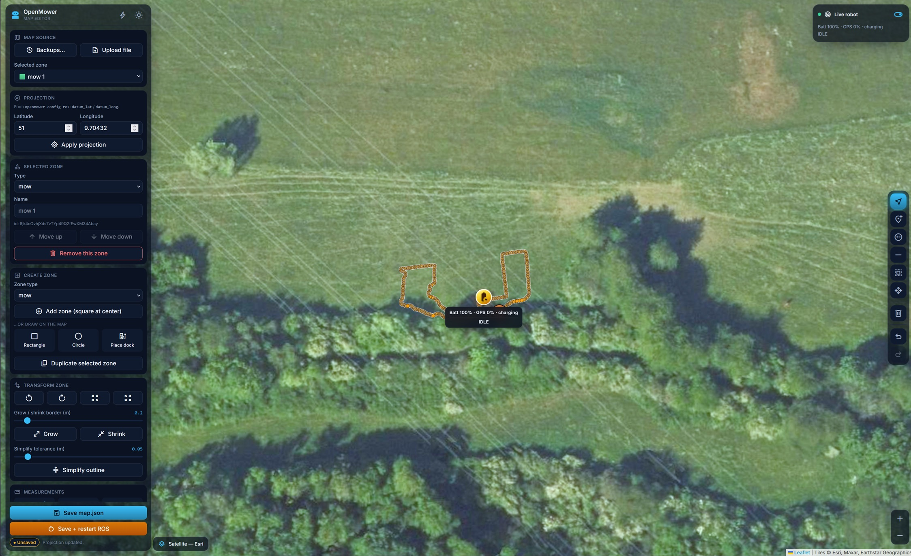

# OpenMower Map Editor

Dark-mode, browser-based map editor for OpenMower JSON maps, deployed via Dockge on OpenMower.

> **Vibecoded notice:** this project is **purely vibecoded**.



## Features

- Edit OpenMower `areas[].outline[]` points directly on a satellite map
- Drag single points to reposition borders precisely
- Add and remove points
- Push nearby points outward with a brush click/drag tool and live radius preview
- Lock closed-loop endpoints (first/last point stay synchronized)
- Snap a selected index range to a straight, equally spaced line
- Multi-select points and move them together
- Box select in multi-select mode (`Shift + drag`)
- Cleanup near-duplicate points with a meter threshold
- Move the home station marker (`docking_stations[0].position`)
- Undo/redo history for editing actions (arrow buttons)
- Auto-load `/data/ros/map.json` (if present)
- Auto-fill projection from `/data/params/mower_params.yaml` (`datum_lat`, `datum_long`)
- Save directly to `/data/ros/map.json` with automatic timestamped backup
- Optional: restart the container named in `OPENMOWER_CONTAINER_NAME` via mounted Docker socket (Save + restart)

## Deploy via Dockge (OpenMower)

1. Open Dockge: [http://openmower:5001](http://openmower:5001)
2. Click **+ Compose**
3. Paste this into the `compose.yaml` field:

```yaml
services:
  openmower-map-editor:
    image: ghcr.io/revlaw/openmowermapeditor:latest
    container_name: openmower-map-editor
    ports:
      - "5080:80"
    volumes:
      - type: bind
        source: /home/openmower/params
        target: /data/params
        read_only: true
      - type: bind
        source: /home/openmower/ros
        target: /data/ros
      - type: bind
        source: /var/run/docker.sock
        target: /var/run/docker.sock
    environment:
      OPENMOWER_CONTAINER_NAME: open_mower_ros
```

1. Click **Deploy**
2. Open the editor at [http://openmower:5080](http://openmower:5080)

## Usage

1. Open the app at [http://openmower:5080](http://openmower:5080).
2. On startup, the editor tries to:
  - load `/data/ros/map.json`
  - read `/data/params/mower_params.yaml` and apply `datum_lat` / `datum_long`
3. If no map is found, load one manually with the file picker.
4. Pick an area in the area selector.
5. Use the tool buttons below the area selector to edit your map.
6. Save your edits:
  - **Save map.json** writes to `/data/ros/map.json` and creates a backup first (`map.json.bak-<timestamp>`).
  - **Save + restart ROS** does the same, then restarts the container set in `OPENMOWER_CONTAINER_NAME` through the mounted Docker socket.
  - If direct save is unavailable, fallback is downloading the map as `openmower-map-edited.json`.
7. Roll back from backup (if needed):
  - Use the **Load map/backup** dropdown (under file upload) to pick either `map.json` (running) or a `map.json.bak-`* file from `/data/ros`.
  - The selected entry is loaded immediately.
  - Click **Save map.json** (or **Save + restart ROS**) to make a loaded backup your active `map.json`.

## Tool Legend

- `↶` Undo the last edit.
- `↷` Redo the last undone edit.
- `◫` Multi-select tool (click points or `Shift + drag` rectangle, then drag group handle).
- `＋` Add point tool (click map to insert a point).
- `◯` Push brush tool (click or hold-and-drag to push nearby points away).
- `╱` Snap line tool (pick start and end point to snap range to a straight line).
- `🧹` Cleanup tool (first click enables cleanup mode and shows slider, second click applies cleanup).
- `✕` Remove selected point.
- `Load map/backup` dropdown Load `map.json` or a backup file directly on selection.

Tool sliders are contextual:

- Brush sliders appear only while brush mode is active.
- Cleanup slider appears only while cleanup mode is active.

## Privacy / GitHub Safety

The included `.gitignore` excludes local/private artifacts such as:

- `map.json` and `*.local.json`
- Cursor local folders (`.cursor/`, `terminals/`, `agent-transcripts/`, `mcps/`)
- common IDE/log/temp files

## Notes

- OpenMower uses local meter coordinates (`x`, `y`), so map projection is an approximation from your configured datum.
- Always validate edited borders before deploying to a mower in production.