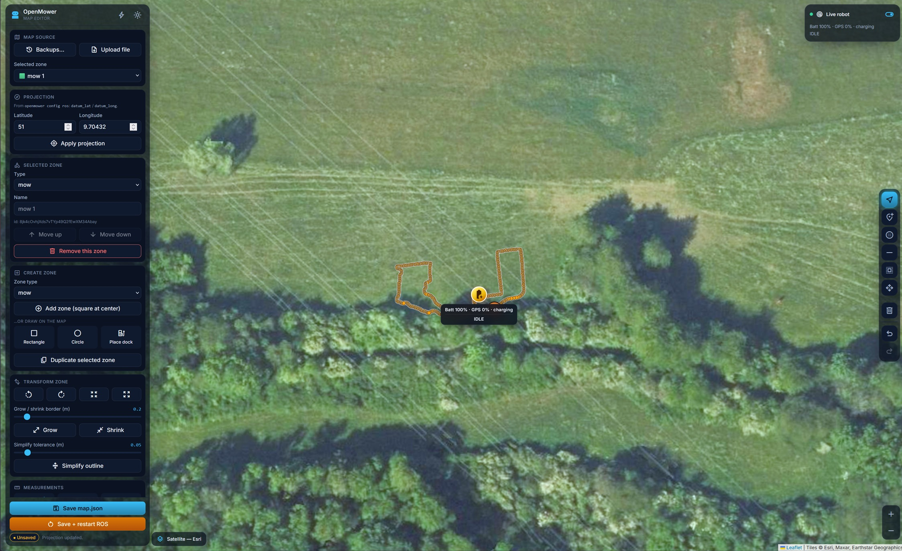

# OpenMower Map Editor

Browser-based map editor for OpenMower JSON maps, deployed via [Dockge](https://github.com/louislam/dockge) on the mower's own Raspberry Pi.

Built with **Svelte 5 + Vite 8 + Tailwind CSS 4** (compiled to static assets at build time) and served by a small **Express 5** backend. The compile step runs during the Docker build, so the Raspberry Pi runtime stays light — it only serves the prebuilt `dist/` plus the `/api/*` endpoints.



## Contents

- [Quick start (Dockge deployment)](#quick-start-dockge-deployment)
- [Features](#features)
- [Usage](#usage)
- [Docker & OpenMower integration](#docker--openmower-integration)
- [Shared data storage (WiFi survey & movement trail)](#shared-data-storage-wifi-survey--movement-trail)
- [Tool legend](#tool-legend)
- [Development](#development)
- [Environment variables](#environment-variables)
- [Security](#security)
- [Privacy / GitHub safety](#privacy--github-safety)
- [Notes](#notes)

## Quick start (Dockge deployment)

Prerequisites: a standard **OpenMower OS v2** install (Docker + Dockge already present), and `open_mower_ros` running with **host networking** (needed for the WiFi survey to see the mower's own radio).

1. Open Dockge: [http://openmower:5001](http://openmower:5001)
2. Click **+ Compose**
3. Paste this into the `compose.yaml` field:

```yaml
services:
  openmower-map-editor:
    image: ghcr.io/revlaw/openmowermapeditor:latest
    container_name: openmower-map-editor
    restart: unless-stopped
    ports:
      - "5080:80"
    volumes:
      - type: bind
        source: /home/openmower/params
        target: /data/params
        read_only: true
      - type: bind
        source: /home/openmower/ros
        target: /data/ros
      - type: bind
        source: /var/run/docker.sock
        target: /var/run/docker.sock
    environment:
      OPENMOWER_CONTAINER_NAME: open_mower_ros
      # Optional tuning (see "Environment variables" below):
      # OPENMOWER_POSE_CONTAINER: open_mower_ros
      # OPENMOWER_POSE_CACHE_MS: "2200"
      # OPENMOWER_STREAM_FRESH_MS: "2000"
      # OPENMOWER_POSE_DISABLE: "0"
      # OPENMOWER_CONTROL_DISABLE: "0"   # set "1" to hide/disable Start/Stop/Home/Reset
      # OPENMOWER_TF_ECHO_TIMEOUT_SEC: "4"
      # OPENMOWER_ROS_TOPIC_TIMEOUT_SEC: "4"
      # OPENMOWER_ROS_TOPIC_FALLBACK_SEC: "10"
      # OPENMOWER_VERBOSE_LOGS: "0"
      # WIFI_MAP_CELL_SIZE_M: "0.75"
      # WIFI_MAP_MAX_POINTS: "2000"
      # WIFI_MAP_FLUSH_MS: "30000"
      # WIFI_MAP_COLLECTOR_INTERVAL_MS: "10000"
      # WIFI_MAP_COLLECTOR_CELL_REVISIT_MS: "300000"
      # WIFI_MAP_COLLECTOR_DISABLE: "0"
      # ROBOT_TRAIL_MIN_DISTANCE_M: "0.15"
      # ROBOT_TRAIL_MAX_POINTS: "20000"
      # ROBOT_TRAIL_FLUSH_MS: "30000"
      # ROBOT_TRAIL_COLLECTOR_DISABLE: "0"
      # ROBOT_TRAIL_ARCHIVE_MAX_SESSIONS: "30"
```

4. Click **Deploy**
5. Open the editor at [http://openmower:5080](http://openmower:5080)

See [Docker & OpenMower integration](#docker--openmower-integration) for what each volume/socket is for, image architectures, and how to update.

## Features

### Zone & geometry editing
- Edit OpenMower `areas[].outline[]` points directly on a satellite map
- Drag single points directly (click and drag without selecting a separate handle first)
- Add and remove points; add and remove full zones (`mow`, `obstacle`, `nav`)
- Push points along your drag with a smear brush (radius + strength sliders, live cursor preview)
- Lock closed-loop endpoints (first/last point stay synchronized)
- Snap a selected index range to a straight, equally spaced line
- Multi-select points and move them together; box select (`Shift + drag`)
- Move the home station marker (`docking_stations[0].position`)
- Undo/redo history for editing actions (arrow buttons)

### Quick create & transform
- Draw rectangle/circle zones, place the dock by clicking, duplicate a zone
- Move a whole zone, rotate/scale about its centroid
- **Grow/shrink** — offset every border by a margin (a buffer)
- Simplify an outline (Douglas–Peucker), smart add-point on the nearest edge, multi-point delete, arrow-key nudging

### Mowing coverage
- **Mowing coverage preview** — overlay the rows the robot drives: green **outline laps** (driven first) around the edge, then cyan **back-and-forth fill** inside, with obstacles carved out. Uses the robot's **real** parameters: global values read live from `/mower_logic` (`tool_width` = spacing, `outline_count`, `outline_overlap_count`, `mow_angle_offset`, …) via `GET /api/mow_params`, plus any **per-area overrides** in `map.json`, and OpenMower's exact angle logic (first-2 m auto-orientation, or a fixed per-area angle). Falls back to the params file + OpenMower defaults offline
- **Per-area mowing overrides (OpenMower v1.2)** — set `outline_count`, `outline_overlap_count`, `outline_offset`, and `angle` **per mow zone** in the **Mowing** panel; written to `map.json` under `area.properties` (an unchecked control = use the global default). Angle is shown in degrees, stored in radians, with a hint showing the effective direction after the robot's global `mow_angle_offset`
- **Exact mowing path (real planner)** — a **Compute exact path** button in the **Mowing** panel runs OpenMower's own `slic3r_coverage_planner` for the selected mow zone (`POST /api/plan_path`) and overlays the **literal** path the robot drives. On-demand and cached; requires the mower online, and flags itself *stale* after you edit. Read-only — planning never commands the robot

### Live robot & control
- **Live robot** overlay with **smooth motion**: the **Live robot** toolbar button opens an **SSE stream** (`GET /api/robot_pose/stream`). The server holds **one persistent ROS subscriber** inside `open_mower_ros` to `/xbot_positioning/xb_pose` (~48 Hz fused GPS/odometry pose, map frame) plus `/xbot_monitoring/robot_state` (telemetry), and pushes each sample to the browser, which **interpolates** the marker between frames — so it glides instead of jumping. On ROS 2 / non-xbot setups it falls back to a `tf2_echo`/`tf_echo` probe, and the client falls back to polling `GET /api/robot_pose` if SSE is unavailable. Marker style reflects **navigation**, **docking**, **charging at dock**, **dock full**, **emergency**, and **error** states, with RTK status. Streaming pauses while the tab is hidden
- **Mower control** — a floating control bar with **Start**, **Stop**, **Home**, and **Reset E-stop**, wired to OpenMower's real services via `POST /api/control`. **Start/Home/Reset need a two-step confirm** (click → *Confirm?* → click); **Stop** is one tap. ⚠️ These move a real robot with spinning blades — disable entirely with `OPENMOWER_CONTROL_DISABLE=1`

### WiFi signal survey & movement trail
- Optional **WiFi signal map** — a main toggle starts/stops the mower recording its radio's dBm value with each live pose; a nested toggle paints the red-to-green heatmap in *this* browser. Shared, mower-side, persists across restarts. See [Shared data storage](#shared-data-storage-wifi-survey--movement-trail) for the full architecture
- Optional **movement trail** — a main toggle starts/stops the mower recording its position history to a shared file; a nested toggle overlays it on the map. Colored/styled by phase (dark blue dashed while docking/undocking, light blue solid while mowing) and auto-archived per mow session, with a **date picker** to browse past days. A separate, client-only breadcrumb of the *current* session also draws whenever **Live robot** is on

### Map management
- Auto-load `/data/ros/map.json` (if present); auto-fill projection from `/data/params/mower_params.yaml` (`datum_lat`, `datum_long`)
- Save directly to `/data/ros/map.json` with automatic timestamped backup
- Optional: restart the container named in `OPENMOWER_CONTAINER_NAME` via the mounted Docker socket (Save + restart)
- **Load map / backup…** gallery with mini-map previews, timestamps, stats, and a diff vs your current map

### Interface
- **Command palette** (`Ctrl`/`Cmd + K`) to run any action, and a **keyboard-shortcut** cheat sheet (`?`)
- **Live measurements** — per-zone area (m²/ha) and perimeter, plus net mowable area (mow minus contained obstacles)
- **Geometry validation** — flags self-intersections, too-few points, degenerate/duplicate vertices, orphan obstacles, and a dock placed inside an obstacle; click an issue to zoom to it
- **Map navigation** — zoom buttons, scroll-wheel/`+`/`−` keys, base-map switching from the command palette
- **Switchable base maps** (bottom-left **Layers**) — Esri satellite (default), the free **20 cm Lower Saxony aerial (DOP20)**, **OpenStreetMap** (global fallback), or a custom XYZ/WMS URL; choice persists
- **Zone management** — friendly **name** (`properties.name`), type (mow/obstacle/nav), reorder, remove; zone picker shows a colored type badge (🟩 mow · 🟥 obstacle · 🟦 nav)
- **Organized sidebar** — panels are **collapsible** and remember their open/closed state
- **Unsaved-changes guard** — an "Unsaved" indicator and a browser prompt before leaving with unsaved edits
- Type-aware overlays while editing (the other two zone types shown dashed for reference)
- Toast notifications and a dark-tech / HUD interface with glass map-overlay panels; light/dark toggle changes sidebar UI only — map colors stay fixed for readability

## Usage

1. Open the app at [http://openmower:5080](http://openmower:5080).
2. On startup, the editor tries to:
   - load `/data/ros/map.json`
   - read `/data/params/mower_params.yaml` and apply `datum_lat` / `datum_long`
3. If no map is found, load one manually with the file picker.
4. Pick a zone from the **Selected zone** dropdown (colored type badge: 🟩 mow · 🟥 obstacle · 🟦 nav).
5. Create zones in the **Create zone** panel — pick a type, then **Add zone** (square at the map center) or draw a rectangle/circle. Use the **Selected zone** panel to pick, name, retype, reorder, or remove a zone, and the **Mowing** panel to set a mow zone's cutting parameters and preview the path.
6. Use the tool dock on the right to edit your map geometry.
7. Optional: turn on **Live robot** to stream the pose from the running ROS container (requires the Docker socket mount). The marker glides in real time from the fused map-frame pose; on fallback (probe) setups it matches the map when TF uses the `map` frame, and may drift relative to `map.json` while only `odom` is available until localization aligns.
8. Optional: turn on **WiFi signal map** to start capture, then the nested toggle to display the heatmap — the mower records the survey autonomously without an open browser and stores it in `/data/ros/wifi-signal-map.json`. Optional: turn on **Movement trail** the same way to record and display the mower's saved path; use the date picker to review past mow sessions.
9. Save your edits:
   - **Save map.json** writes to `/data/ros/map.json` and creates a backup first (`map.json.bak-<timestamp>`).
   - **Save + restart ROS** does the same, then restarts the container set in `OPENMOWER_CONTAINER_NAME` through the mounted Docker socket.
   - If direct save is unavailable, fallback is downloading the map as `openmower-map-edited.json`.
10. Roll back from backup (if needed):
    - Click **Load map / backup…** to open the gallery of `map.json` (running) and `map.json.bak-*` versions from `/data/ros`.
    - Each version shows a **mini-map preview**, a friendly timestamp, summary stats (zones / points / mow area), and the **difference vs your current map** (Δ zones / points / area).
    - Click **Load this version** to load it (nothing is overwritten).
    - Click **Save map.json** (or **Save + restart ROS**) to make a loaded backup your active `map.json`.

## Docker & OpenMower integration

The editor ships as a single multi-stage Docker image (see [`Dockerfile`](./Dockerfile)): a build stage compiles the Svelte/Vite frontend to static assets, then a lean `node:22-alpine` runtime stage serves that `dist/` output plus the Express `/api/*` routes. Nothing on the Raspberry Pi needs Node, Vite, or any build tooling — only the built image.

### Why the Docker socket is mounted

`/var/run/docker.sock` is bind-mounted into the container so the backend can reach into the mower's own `open_mower_ros` container without SSH or a custom sidecar. All that access is funneled through one helper (`dockerApiRequest`) and small, fixed shell-script templates piped into `docker exec` — never raw string concatenation of user input. It's used for:

- Live pose streaming and the fallback TF/topic probes
- Reading mow parameters (`/mower_logic`) and running the exact-path planner
- Mower control (Start/Stop/Home/Reset), gated by `OPENMOWER_CONTROL_DISABLE`
- **Save + restart ROS** — restarting `OPENMOWER_CONTAINER_NAME` after a save
- The autonomous WiFi survey collector and movement-trail capture (both run as long-lived subscribers inside `open_mower_ros`)

This means the map editor container has effectively the same power as root on the host (see [Security](#security)) — mount it only on a trusted LAN.

### Volumes

| Mount | Container path | Purpose | Mode |
| --- | --- | --- | --- |
| `/home/openmower/params` | `/data/params` | Reads `mower_params.yaml` for the GPS datum and live mowing parameters | read-only |
| `/home/openmower/ros` | `/data/ros` | Reads/writes `map.json` + backups, the WiFi survey file, and the movement-trail history/archive | read-write |
| `/var/run/docker.sock` | `/var/run/docker.sock` | Lets the backend `docker exec` into `open_mower_ros` (see above) | read-write |

`OPENMOWER_CONTAINER_NAME` (default `open_mower_ros`) must match the actual ROS container name if a non-standard OpenMower install renamed it; `OPENMOWER_POSE_CONTAINER` can point pose/control calls at a different container if it's split from the one restarted on save.

### Image & architectures

Published images are multi-arch (`linux/amd64` + `linux/arm64`) at `ghcr.io/revlaw/openmowermapeditor:latest`, covering both a Raspberry Pi (`arm64`) and an x86 dev machine. The frontend build stage runs under `--platform=$BUILDPLATFORM` so Vite's native helper binaries never execute under QEMU emulation during a cross-arch build.

### Updating

In Dockge: open the stack, click **Pull** to fetch the newer `:latest` image, then **Recreate**/**Restart**. Your `map.json`, backups, WiFi survey, and movement-trail data all live under the bind-mounted `/home/openmower/ros`, so they persist across image updates untouched.

### Building locally

[`docker-compose.build.yml`](./docker-compose.build.yml) builds the image from source instead of pulling it — useful for testing a change before it's published:

```bash
docker compose -f docker-compose.build.yml up --build
```

It targets the same `linux/amd64` + `linux/arm64` platforms and binds `./params` / `./ros` from the repo instead of the mower's real directories, so it's safe to run on a dev machine.

## Shared data storage (WiFi survey & movement trail)

The WiFi heatmap and the movement trail are both **shared, mower-side state** — not map geometry, not per-browser data, and not dependent on any browser being open. They're built on the same pattern:

- A single, fixed-name, persistent `rospy` subscriber runs inside `open_mower_ros` (reused across restarts of the editor, not spawned per sample) and feeds the collector.
- Capture is an explicit on/off toggle, **persisted** in the store file itself (`captureEnabled`) so it survives an editor restart, and shared across every connected browser — not a local display preference.
- In-memory state is written **atomically** (`<file>.tmp` then `rename`) at most once per flush interval, owned like the mower's own map files (`openmower:openmower`, mode `664`).
- Clearing first copies the current file to `<file>.bak-clear` as a one-shot undo, then wipes and flushes the empty state immediately.
- Browsers poll with a revision number; if nothing changed since the browser's last-known revision, the response omits the payload (`notModified: true`) instead of resending it.
- A numeric env var outside its allowed range isn't silently ignored — the server logs a startup `WARN` naming the clamped value it actually used.

### WiFi signal survey specifics

- Samples the mower radio's dBm roughly every 10 seconds (`WIFI_MAP_COLLECTOR_INTERVAL_MS`) alongside the fused pose, from `/proc/net/wireless` — this requires `open_mower_ros` to use **host networking**.
- Readings are merged into spatial cells (`WIFI_MAP_CELL_SIZE_M`, default `0.75 m`): a newly visited cell is stored immediately; a known cell is only re-recorded after both `WIFI_MAP_COLLECTOR_CELL_REVISIT_MS` has passed and the signal changed by at least 3 dBm — avoiding repeated writes while stationary.
- Capped at `WIFI_MAP_MAX_POINTS` cells (default 2,000; oldest evicted first). A full default survey is typically well under 200 KB.
- Samples outside the current `map.json` bounds (plus a size-aware safety margin) are rejected, so an unlocalized start-up pose can't pollute the heatmap.
- If the autonomous collector is disabled (`WIFI_MAP_COLLECTOR_DISABLE=1`), an open browser with **Live robot** on can still record as a fallback. The **WiFi signal map** toggle turns itself off automatically (with a toast) if live pose reports a fatal error, mirroring how **Live robot** handles the same failure.

API: `GET /api/wifi-map?revision=<n>`, `POST /api/wifi-map/capture` (start/stop), `POST /api/wifi-map/samples` (browser-fallback ingestion), `DELETE /api/wifi-map` (backup + clear for everyone).

### Movement trail specifics

- Every live-pose sample is appended to the history if it's moved at least `ROBOT_TRAIL_MIN_DISTANCE_M` (default 0.15 m) from the last saved point — this is a **path**, so points are throttled by distance, never merged/averaged like the WiFi cells.
- Each point is tagged with a phase (`docking`/`mowing`/none) derived from mower state, used to color and dash/solid-style the line.
- Capped at `ROBOT_TRAIL_MAX_POINTS` (default 20,000; oldest dropped first).
- A rising edge into the "mowing" phase **archives** the just-finished session to a dated file and starts a fresh history, so repeated passes over the same area don't pile up. Up to `ROBOT_TRAIL_ARCHIVE_MAX_SESSIONS` sessions are kept (default 30, oldest pruned) and browsable via the date picker.
- `ROBOT_TRAIL_COLLECTOR_DISABLE=1` is a hard kill-switch independent of the in-app capture toggle.

API: `GET /api/robot-trail?revision=<n>`, `DELETE /api/robot-trail` (backup + clear), `POST /api/robot-trail/capture` (start/stop), `GET /api/robot-trail/archive` (list past sessions), `GET /api/robot-trail/archive/:id` (one session's points).

### Vanilla OpenMower compatibility

Neither collector depends on `rpi-monitor`, `jq`, the Docker CLI, host Python, or anything installed directly on the Raspberry Pi — they talk to Docker through the mounted Engine socket and run their small subscriber inside the official `open_mower_ros` container, where ROS, Bash, Python 3, and standard command-line utilities already exist. The standard OpenMower OS v2 setup (host networking on `open_mower_ros`, the Docker socket, and the `/home/openmower/ros` bind mount above) is sufficient; missing fused pose, map bounds, or in-container commands are reported in `storage.collector.lastError` and don't affect normal map editing. No survey or trail data is uploaded anywhere — it stays on the mower.

Reconnects react to Docker's container-start events for `open_mower_ros` rather than relying only on polling, so both collectors resume within moments of the ROS container coming back up; a slow poll loop remains as a fallback and logs retry warnings sparingly (first failure, then every 10th) so a mower that's mid-boot won't spam the logs.

## Tool legend

Tools live in the floating dock on the right (icons from [Material Symbols Outlined](https://fonts.google.com/icons)). Every action is also reachable from the **command palette** (`Ctrl`/`Cmd + K`); press `?` for the full shortcut cheat sheet.

- **near_me** — select / drag (`V`): default mode, drag a vertex or click to select. Arrow keys nudge the selection (`Shift` = larger step).
- **add_location_alt** — add point (`A`): click near an outline and the vertex is inserted on the **nearest edge**.
- **blur_circular** — push brush (`B`): drag across the outline to push points along your stroke; radius/strength sliders appear in the sidebar.
- **horizontal_rule** — snap line (`S`): pick start and end point.
- **select_all** — multi-select (`M`): click points or `Shift + drag` a rectangle, then drag the group handle.
- **open_with** — move whole zone (`G`): drag the centroid handle to translate the entire zone.
- **delete** — remove selected point(s) (`Del`): deletes the whole multi-selection when several points are selected.
- **undo** / **redo** — history (`Ctrl + Z` / `Ctrl + Shift + Z`).

Create & transform (sidebar **Create** and **Transform zone** panels, also in the command palette):

- **Rectangle** (`R`) / **Circle** (`O`) — drag on the map to draw a new zone of the chosen type.
- **Place dock** — click the map to set the docking station (`docking_stations[0]`).
- **Duplicate zone** (`Ctrl + D`) — copy the selected zone, offset so the copy is visible.
- **Rotate** ±15° / **Scale** ±5% — transform the selected zone about its centroid.
- **Grow / Shrink** — offset every border of the selected zone outward/inward by a margin (a buffer; unlike Scale it keeps a uniform border distance). For a donut (mow + obstacle), **Grow** the mow and **Shrink** the obstacle to widen the mowable ring.
- **Simplify outline** — Douglas–Peucker reduction with an adjustable tolerance, to thin out dense outlines.
- **Create zone** panel adds a zone (square at center, or rectangle/circle draw); the **Selected zone** panel names / retypes / reorders / removes the current zone.
- **Live robot** (toolbar toggle) streams the fused ROS pose via the mounted Docker socket (SSE) and interpolates the marker for smooth motion + heading. While driving/mowing it shows a **top-down mower** icon rotated to the live heading; other states swap the icon (docking, dock charging, dock full, emergency, error) and keep the badge fixed. Preference is stored in `localStorage`. The dock uses **ev_station** on the map.
- `Load map / backup…` opens a gallery of saved versions, each with a mini-map preview, timestamp, stats, and a diff vs your current map.
- **Zoom** buttons sit at the bottom-right; the **Layers** button (bottom-left) switches the base map.

Tool sliders are contextual:

- Brush sliders appear only while brush mode is active.
- Mowing parameters (**Mowing** panel) and transform controls (**Transform zone** panel) live in the sidebar.
- On touch devices, brush also supports finger paint (`touchstart`/`move`/`end`).
- Light/dark mode affects sidebar/tool styling only. Map line/point colors remain identical in both modes.

## Development

Requirements: Node **22.12+** (Vitest 5 floor — Node 22.12–23, 24, or 26+; the Docker image already builds on `node:22-alpine`).

Stack (kept current):

- Svelte **5**, Vite **8**, `@sveltejs/vite-plugin-svelte` **7**
- Tailwind CSS **4** (`@tailwindcss/postcss`), PostCSS **8**
- Vitest **5** (+ happy-dom for the component mount smoke test)
- Express **5**, js-yaml **5**, Leaflet **1.9**

```bash
npm install

# Run the Express backend with local (non-container) data paths:
PORT=5080 MAP_PATH=./ros/map.json PARAMS_PATH=./params/mower_params.yaml node server.js

# In another terminal, start Vite with HMR (proxies /api -> :5080):
npm run dev          # http://localhost:5173

npm test             # vitest unit tests (geometry, projection, tools, validation)
npm run build        # compile the Svelte app into dist/
npm start            # serve the built dist/ via Express (production entry)
```

Project layout:

- `src/lib/` — framework-free, unit-tested logic: `geo/` (projection, geometry, offset/simplify, coverage, brush/snap tools), `format/` (map.json + outline/shape helpers), `validation.js`, `measurements.js`, `summary.js`, `api.js`, and Svelte `stores/`.
- `src/map/` — the Leaflet controller (rendering + interactions).
- `src/components/` — Svelte UI (shell, sidebar panels, tool dock, robot HUD, command palette).
- `server.js` — serves the built `dist/` and implements the map, robot-pose, restart, backup, WiFi-survey, and movement-trail APIs. Paths are configurable for local development.

`POST/GET /api/map`, `/api/map/backups`, `/api/params`, `/api/robot_pose`, `/api/robot_pose/stream` (SSE), `/api/mow_params`, `POST /api/plan_path`, `POST /api/control`, `/api/wifi-map`, and `/api/robot-trail` are the stable backend contract; the map.json on-disk format is unchanged.

## Environment variables

### Core paths & server

| Variable | Default | Purpose |
| --- | --- | --- |
| `PORT` | `80` | HTTP listen port inside the container (compose maps `5080:80`) |
| `MAP_PATH` | `/data/ros/map.json` | Map file path (override for local dev) |
| `PARAMS_PATH` | `/data/params/mower_params.yaml` | Params file path (override for local dev) |
| `DOCKER_SOCKET_PATH` | `/var/run/docker.sock` | Override if your host uses a non-default Docker socket |

### ROS / robot integration

| Variable | Default | Purpose |
| --- | --- | --- |
| `OPENMOWER_CONTAINER_NAME` | `open_mower_ros` | Container restarted by **Save + restart ROS** |
| `OPENMOWER_POSE_CONTAINER` | same as above | Container used for TF echo / ROS topic sampling |
| `OPENMOWER_POSE_DISABLE` | `0` | Set `1` to disable live pose entirely |
| `OPENMOWER_CONTROL_DISABLE` | `0` | Set `1` to disable the Start/Stop/Home/Reset mower control buttons |
| `OPENMOWER_POSE_CACHE_MS` | `2200` | Server-side cache for the pose fallback probe (ms) |
| `OPENMOWER_STREAM_FRESH_MS` | `2000` | How long a streamed pose sample stays "fresh" before the SSE endpoint falls back to the probe (ms) |
| `OPENMOWER_TF_ECHO_TIMEOUT_SEC` | `4` | Timeout for `tf_echo` / `tf2_echo` inside the container |
| `OPENMOWER_ROS_TOPIC_TIMEOUT_SEC` | `4` | Timeout for `rostopic` / `ros2 topic echo` samples |
| `OPENMOWER_ROS_TOPIC_FALLBACK_SEC` | `10` | Longer timeout when sampling `/mower_logic/current_state` fallback |
| `OPENMOWER_VERBOSE_LOGS` | off | Set `1` to log every HTTP request, Docker API call, and routine file reads |

### WiFi signal survey

| Variable | Default | Purpose |
| --- | --- | --- |
| `WIFI_MAP_PATH` | `/data/ros/wifi-signal-map.json` | Shared WiFi survey file |
| `WIFI_MAP_CELL_SIZE_M` | `0.75` | Spatial cell size used to merge nearby readings (clamped to `0.25`–`5`) |
| `WIFI_MAP_MAX_POINTS` | `2000` | Hard upper bound for stored survey cells (clamped to `100`–`10000`) |
| `WIFI_MAP_FLUSH_MS` | `30000` | Minimum delay between atomic disk writes (clamped to `10000`–`300000`) |
| `WIFI_MAP_COLLECTOR_INTERVAL_MS` | `10000` | Delay between autonomous WiFi samples (clamped to `5000`–`300000`) |
| `WIFI_MAP_COLLECTOR_CELL_REVISIT_MS` | `300000` | Minimum age before a known cell may be recorded again (clamped to `60000`–`3600000`) |
| `WIFI_MAP_COLLECTOR_DISABLE` | `0` | Set `1` to disable autonomous collection and use browser fallback |

### Movement trail

| Variable | Default | Purpose |
| --- | --- | --- |
| `ROBOT_TRAIL_PATH` | `/data/ros/movement-trail.json` | Shared movement-trail history file |
| `ROBOT_TRAIL_MIN_DISTANCE_M` | `0.15` | Minimum spacing between saved trail points (clamped to `0.05`–`5`) |
| `ROBOT_TRAIL_MAX_POINTS` | `20000` | Hard upper bound for stored trail points (clamped to `1000`–`200000`) |
| `ROBOT_TRAIL_FLUSH_MS` | `30000` | Minimum delay between atomic disk writes (clamped to `10000`–`300000`) |
| `ROBOT_TRAIL_COLLECTOR_DISABLE` | `0` | Set `1` to disable movement-trail capture entirely (hard kill-switch, independent of the in-app toggle) |
| `ROBOT_TRAIL_ARCHIVE_MAX_SESSIONS` | `30` | Past mow sessions kept for the history picker before the oldest is deleted (clamped to `1`–`365`) |

Inside the container the defaults match the bind mounts (`/data/ros`, `/data/params`); for local development point `MAP_PATH` / `PARAMS_PATH` at files in the repo. A `WIFI_MAP_*` or `ROBOT_TRAIL_*` numeric value outside its clamped range is not silently ignored — the server logs a startup `WARN` naming the value it actually used instead.

## Security

Mounting **`/var/run/docker.sock`** gives the editor API the same ability to control Docker as root on the host. Only deploy on a **trusted network** (for example your home LAN), do not expose port `5080` to the public internet without an additional access layer, and treat saved map data as sensitive to your property layout.

## Privacy / GitHub safety

The included `.gitignore` excludes local/private artifacts such as:

- `map.json` and `*.local.json`
- Cursor local folders (`.cursor/`, `terminals/`, `agent-transcripts/`, `mcps/`)
- common IDE/log/temp files

This repository should not contain real mower coordinates, passwords, or API keys.

## Notes

- OpenMower uses local meter coordinates (`x`, `y`), so map projection is an approximation from your configured datum.
- Aerial imagery coverage and zoom depth vary by provider and region. Esri World Imagery is global but lacks deep zoom in many rural areas (it returns blank tiles past where data exists) — switch to OpenStreetMap or a custom regional source via the **Layers** control there.
- Zone names are stored under `properties.name` (editor convenience metadata). OpenMower's firmware selects zones by order/index, not by name, so naming doesn't change robot behavior.
- Smooth live pose runs a **persistent `rospy` subscriber** (`/xbot_positioning/xb_pose` + `/xbot_monitoring/robot_state`) inside the ROS container via a **long-lived streamed `docker exec`**, so there's no per-poll exec overhead; samples are pushed to the browser over **SSE** and interpolated client-side. When `xbot_msgs` isn't present (ROS 2 / other setups) the server falls back to **`ros2 run tf2_ros tf2_echo`** / **`rosrun tf tf_echo`** and topic sampling (`rostopic echo` before `ros2 topic echo`), parsed with **stdlib-only `python3`**. If no pose is published yet, the HUD shows the probe error.
- The **exact mowing path** calls `/slic3r_coverage_planner/plan_path` inside the ROS container (via a one-shot `rospy` `docker exec`), replicating `MowingBehavior.cpp`'s request exactly (angle incl. global `mow_angle_offset`, `outline_count`/`overlap`/`offset`, `tool_width` spacing, obstacles as holes, linear fill). It plans only — it never commands motion — and results are cached briefly per request.
- WiFi signal is read from `/proc/net/wireless` by a persistent, fixed-name `rospy` collector inside the ROS container, which must share the host network namespace. The compact survey is stored separately from `map.json`, written atomically at most once per flush interval, owned like the mower map files, and never sent to GitHub.
- Always validate edited borders before deploying to a mower in production.
