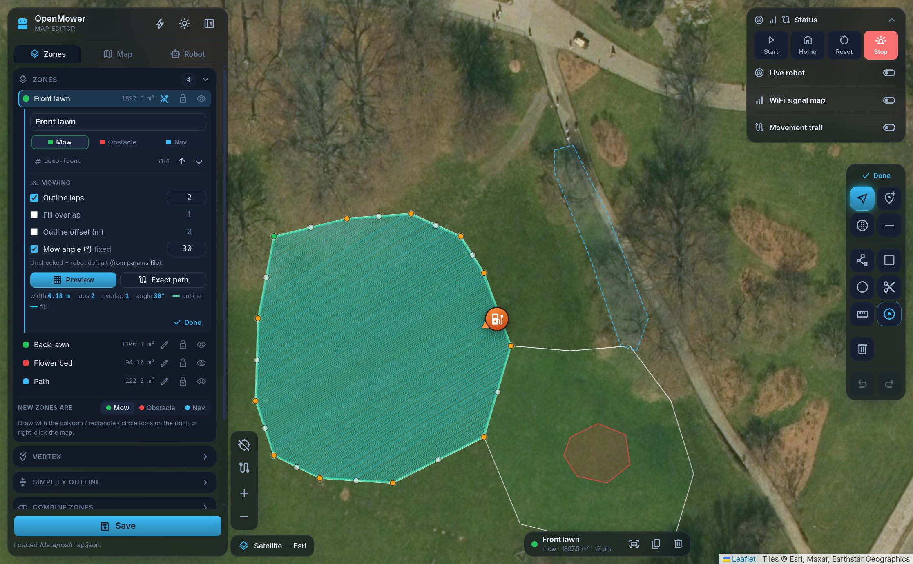
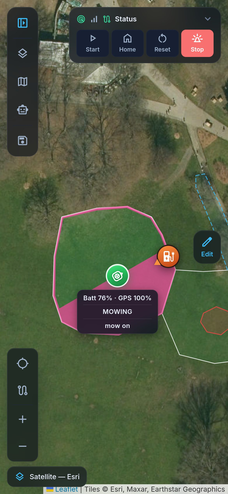
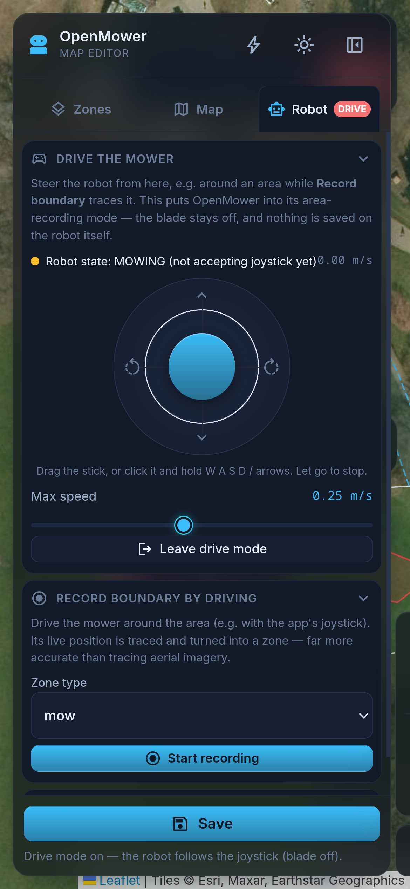

# OpenMower Map Editor

A browser-based map editor for [OpenMower](https://github.com/ClemensElflein/open_mower_ros), running on the mower's own Raspberry Pi (deployed via [Dockge](https://github.com/louislam/dockge)). Edit zones on a satellite map, preview the exact mowing path, watch the robot live, drive it, and record new zones with it.

Built with **Svelte 5 + Vite 8 + Tailwind CSS 4** (compiled at Docker build time) and a small **Express 5** backend — the Pi only serves the prebuilt `dist/` plus `/api/*`.



<p align="center">
  
  &nbsp;&nbsp;&nbsp;
  
</p>
<p align="center"><sub><b>Phone:</b> where the robot is and how it drove (view mode) · driving it with the joystick</sub><br><sub>Screenshots use a demo map in a public park.</sub></p>

## Quick start

Prerequisites: **OpenMower OS v2** (Docker + Dockge), with `open_mower_ros` using **host networking** (only needed for the WiFi survey).

1. Open Dockge at [http://openmower:5001](http://openmower:5001) and click **+ Compose**.
2. Paste:

   ```yaml
   services:
     openmower-map-editor:
       image: ghcr.io/revlaw/openmowermapeditor:latest
       container_name: openmower-map-editor
       restart: unless-stopped
       ports:
         - "5080:80"
       volumes:
         - type: bind
           source: /home/openmower/params
           target: /data/params
           read_only: true
         - type: bind
           source: /home/openmower/ros
           target: /data/ros
         - type: bind
           source: /var/run/docker.sock
           target: /var/run/docker.sock
       environment:
         OPENMOWER_CONTAINER_NAME: open_mower_ros
         # OPENMOWER_CONTROL_DISABLE: "1"   # disable Start/Stop/Home/Reset and joystick driving
         # More options: see "Environment variables" below.
   ```

3. Click **Deploy** and open [http://openmower:5080](http://openmower:5080).

To update: open the stack in Dockge, **Pull**, then **Recreate**. Maps, backups and recorded data live in `/home/openmower/ros` and survive updates.

## Features

**Editing zones**
- All zones drawn on a satellite map — click one to select it. A zone list shows each zone's type and area, with **lock** / **hide** toggles and a **pencil** that opens an inline editor (name, type, order, id, mowing settings).
- Drag vertices, drag an edge's midpoint to add one, push points with a brush, straighten a run of points, `Shift`-click / `Shift`-drag / `Ctrl + A` to select several and move them together.
- Draw polygons, rectangles and circles; split a zone along a line; merge, cut out or clip zones against each other; simplify dense outlines with a live preview.
- **Magnetic snapping** to neighbouring zones' vertices and edges (hold `Alt` to bypass), a ruler, exact vertex coordinates, and right-click / long-press menus.
- Place the docking station by click, by exact position/heading, or from the robot's live pose.

**Mowing**
- **Coverage preview** of the rows the robot drives, using its real parameters (read live from `/mower_logic`) plus per-zone overrides (`outline_count`, `outline_overlap_count`, `outline_offset`, `angle`).
- **Exact path** — runs OpenMower's own `slic3r_coverage_planner` and overlays the literal path (read-only, never moves the robot).

**Robot**
- **Live robot** with smooth motion, status and RTK, plus **find & follow**.
- **Mower control** — Start / Home / Reset need a two-tap confirm; Stop is one tap.
- **Drive screen** — *Start drive mode* turns the app into a drive view (the map fills the window and follows the robot), with an on-screen joystick (touch, mouse or `W A S D`), **Go to** and **Record**. Drive mode switches OpenMower into its area-recording mode, the only mode in which it accepts joystick commands; the blade stays off. The robot stops when you let go, when the tab loses focus, or when commands stop arriving for 0.4 s, and speed is capped at 0.5 m/s.
- **Go to** — tap a spot and the robot drives there by itself (0.3 m/s), routing around obstacle zones and keeping 35 cm from zone edges. It won't start while the robot is in the docking station (back it out with the joystick first), and it stops on STOP, when you touch the joystick, if its position gets stale or RTK accuracy is worse than 20 cm, or if it strays 25 cm off the route.
- **Record a zone by driving** around it (drive screen or Robot tab), or turn a stretch of the movement trail into a zone.
- **Movement trail** with a calendar (days with data are marked) and a **WiFi signal heatmap**. Both are recorded on the mower itself, with no browser needed.

**Safety net & files**
- Save shows what changed and any problems before writing `map.json` (a timestamped backup is made first); optionally restart ROS so the robot loads it.
- Unsaved edits survive a reload or crash (offered for restore), undo/redo, and an unsaved-changes guard.
- Checks for self-intersections, unreachable mow zones, a dock outside drivable zones, zones narrower than the cutting width, and more.
- Backups gallery with previews and diffs; **GeoJSON / KML** import and export (e.g. to trace in QGIS or Google Earth).

**Interface**
- Sidebar tabs **Zones · Map · Robot**, foldable into a slim icon rail (`Ctrl + B`).
- Phones open in a calm **view mode** (map, zones, robot, trail); tap **Edit** for the tools.
- Command palette (`Ctrl + K`), shortcut sheet (`?`), switchable base maps (Esri, Lower Saxony DOP20, OSM, custom XYZ/WMS), light/dark theme.

## Controls

| Action | How |
| --- | --- |
| Select zone / point | Click (`Shift` + click adds points, `Shift` + drag box-selects, `Ctrl + A` all points) |
| Move points | Drag any selected point, or arrow keys (`Shift` = bigger steps) |
| Add point | Drag an edge's midpoint dot, or the add-point tool (`A`) |
| Draw zone | Polygon `P` · rectangle `R` · circle `O` (type: "New zones are" in the Zones tab) |
| Split · ruler · brush · straighten | `X` · `D` · `B` · `S` |
| Edit zone details | Pencil on the zone row (or double-click it) |
| Lock / hide zone · cycle zones | `L` / `H` · `[` `]` |
| Delete point · undo · redo | `Del` · `Ctrl + Z` · `Ctrl + Shift + Z` |
| Fit zone · fit map · save | `F` · `Shift + F` · `Ctrl + S` |
| Go to (drive screen) | **Go to** → tap the target → **Go** · `Esc` cancels |
| Context menu | Right-click / long-press a zone, point, the dock or the map |

## Usage notes

- On start the editor loads `/data/ros/map.json` and takes the projection origin from `mower_params.yaml` (`datum_lat` / `datum_long`).
- OpenMower only reads `map.json` on start-up — tick **Restart ROS after saving** in the save dialog to apply changes right away.
- To roll back, open **Map → File → Backups…**, load a version (nothing is overwritten) and save it.
- Typical robot-assisted mapping: **Robot** tab → *Start drive mode* → **Record** → drive around the area (joystick, or **Go to** corner by corner) → **Finish** → **Exit** → save.

## Docker & OpenMower integration

The image is multi-arch (`linux/amd64`, `linux/arm64`) at `ghcr.io/revlaw/openmowermapeditor:latest`. To build it yourself: `docker compose -f docker-compose.build.yml up --build` (uses the repo's `./params` / `./ros`).

| Mount | Container path | Purpose |
| --- | --- | --- |
| `/home/openmower/params` | `/data/params` (read-only) | GPS datum and fallback mowing parameters |
| `/home/openmower/ros` | `/data/ros` | `map.json` + backups, WiFi survey, movement trail |
| `/var/run/docker.sock` | `/var/run/docker.sock` | Reach into `open_mower_ros` |

The Docker socket lets the backend run small, fixed scripts inside `open_mower_ros` (via the Docker Engine API — no SSH, nothing installed on the Pi): the live pose stream, mowing parameters and path planner, mower control and joystick driving, restarting ROS after a save, and the WiFi / movement-trail collectors. The collectors run on the mower even with no browser open; their data stays on the mower.

## Development

Requires Node **22.12+**.

```bash
npm install

# Backend with repo-local data:
PORT=5080 MAP_PATH=./ros/map.json PARAMS_PATH=./params/mower_params.yaml node server.js

# Frontend with hot reload (proxies /api to :5080), in a second terminal:
npm run dev          # http://localhost:5173

npm test             # Vitest
npm run build        # compile to dist/
npm start            # serve dist/ via Express (production entry)
```

See [AGENTS.md](./AGENTS.md) for the code walkthrough and conventions.

## Environment variables

**Core**

| Variable | Default | Purpose |
| --- | --- | --- |
| `PORT` | `80` | HTTP port inside the container |
| `MAP_PATH` | `/data/ros/map.json` | Map file |
| `PARAMS_PATH` | `/data/params/mower_params.yaml` | Params file |
| `DOCKER_SOCKET_PATH` | `/var/run/docker.sock` | Docker socket |

**Robot**

| Variable | Default | Purpose |
| --- | --- | --- |
| `OPENMOWER_CONTAINER_NAME` | `open_mower_ros` | Container restarted after a save |
| `OPENMOWER_POSE_CONTAINER` | same as above | Container used for pose, control, planning and driving |
| `OPENMOWER_CONTROL_DISABLE` | `0` | `1` disables mower control and joystick driving |
| `OPENMOWER_POSE_DISABLE` | `0` | `1` disables live pose |
| `OPENMOWER_POSE_CACHE_MS` | `2200` | Cache for the fallback pose probe |
| `OPENMOWER_STREAM_FRESH_MS` | `2000` | How long a streamed pose stays fresh before falling back to the probe |
| `OPENMOWER_TF_ECHO_TIMEOUT_SEC` | `4` | `tf_echo` / `tf2_echo` timeout |
| `OPENMOWER_ROS_TOPIC_TIMEOUT_SEC` | `4` | `rostopic` / `ros2 topic echo` timeout |
| `OPENMOWER_ROS_TOPIC_FALLBACK_SEC` | `10` | Timeout for the `/mower_logic/current_state` fallback |
| `OPENMOWER_VERBOSE_LOGS` | off | `1` logs every request and Docker call |

**WiFi survey**

| Variable | Default | Purpose |
| --- | --- | --- |
| `WIFI_MAP_PATH` | `/data/ros/wifi-signal-map.json` | Survey file |
| `WIFI_MAP_CELL_SIZE_M` | `0.75` | Cell size for merging readings (`0.25`–`5`) |
| `WIFI_MAP_MAX_POINTS` | `2000` | Max stored cells (`100`–`10000`) |
| `WIFI_MAP_FLUSH_MS` | `30000` | Min delay between disk writes (`10000`–`300000`) |
| `WIFI_MAP_COLLECTOR_INTERVAL_MS` | `10000` | Delay between samples (`5000`–`300000`) |
| `WIFI_MAP_COLLECTOR_CELL_REVISIT_MS` | `300000` | Min age before a cell is re-recorded (`60000`–`3600000`) |
| `WIFI_MAP_COLLECTOR_DISABLE` | `0` | `1` disables the on-mower collector (browser fallback) |

**Movement trail**

| Variable | Default | Purpose |
| --- | --- | --- |
| `ROBOT_TRAIL_PATH` | `/data/ros/movement-trail.json` | Trail history file |
| `ROBOT_TRAIL_MIN_DISTANCE_M` | `0.15` | Min spacing between points (`0.05`–`5`) |
| `ROBOT_TRAIL_MAX_POINTS` | `20000` | Max stored points (`1000`–`200000`) |
| `ROBOT_TRAIL_FLUSH_MS` | `30000` | Min delay between disk writes (`10000`–`300000`) |
| `ROBOT_TRAIL_COLLECTOR_DISABLE` | `0` | `1` disables trail capture entirely |
| `ROBOT_TRAIL_ARCHIVE_MAX_SESSIONS` | `30` | Past sessions kept (`1`–`365`) |

Out-of-range numeric values are clamped, and the server logs a startup warning with the value it used.

## Security

Mounting the Docker socket gives the editor root-equivalent control over the host, and anyone who can reach the editor can move the mower (unless `OPENMOWER_CONTROL_DISABLE=1`). Run it only on a **trusted network** — don't expose port `5080` to the internet without an access layer. Treat map data as sensitive (it describes your property).

The repository's `.gitignore` keeps local maps and robot data (`map.json`, `*.local.json`, `ros/`, `params/`) and editor/IDE artifacts out of git; never commit real coordinates or credentials.

## Notes

- OpenMower uses local metric coordinates; the satellite overlay is an approximation around your datum.
- Aerial imagery depth varies by provider and region — switch base maps via **Layers** if tiles go blank.
- Zone names (`properties.name`) are editor metadata; the firmware selects zones by order.
- Always check edited borders before letting the mower use them.
